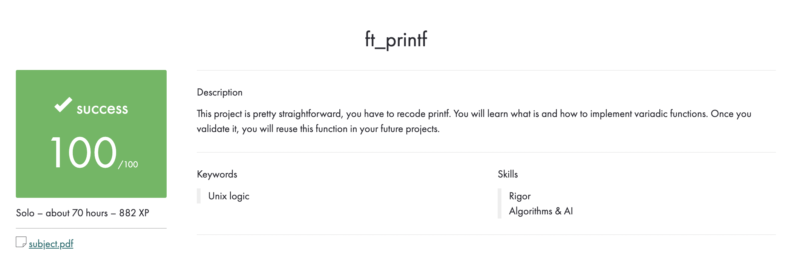

# 42-ft_printf
### The goal of this project is pretty straightforward. You will recode printf(). You will mainly learn about using a variable number of arguments.

## Function prototype
```C
int	ft_printf(const char *str, ...)
```